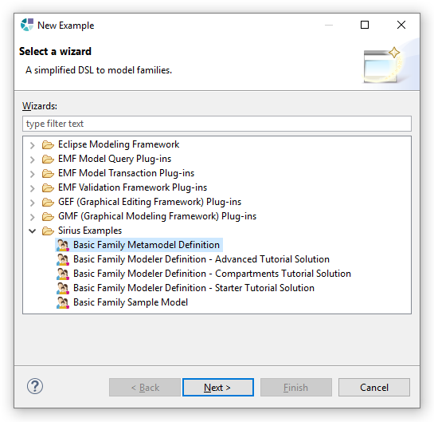

# Basicfamily Tutorial

This tutorial explains how to use Eclipse Sirius to create graphical editors for visually describing a family.
It is composed of five parts, from the definition of the domain model to the deployment to end-users via an updatesite,
including the creation of advanced editors and tools (ports, compartments, tables, etc.). 

<b>1. Domain Model Tutorial</b>  
This tutorial explains how to create a Domain Model with Ecore Tools. 
The created Domain Model defines basic concepts about families and is used by the following tutorial of this series. 

  
<b>2. Advanced Tutorial</b>  
This tutorial explains how to use advanced features of Sirius. 
The instructions will guide you extending the result of the Sirius Starter Tutorial with:  
        - Edition tools: edge creation, edge reconnection, element deletion, label edition 
        - Graphical improvements: SVG images, styles customization 
        - Complexity management: layers, filters, validation rules, quick fixes 
        - Other kinds of representations: containers, bordered nodes, tables, navigation between representations 
        - Extensions: Java services 

  
<b>3. Compartments Tutorial</b>  
This tutorial explains how to create compartments. 
The instructions will guide you creating a diagram using fixed and dynamic compartments to visualize the different kinds of relationships of a person: 
        - parents 
        - siblings 
        - children 
        - grandchildren 
This tutorial starts from the result of the Starter Tutorial. 

  
<b>4. Update Site</b>  
This tutorial explains how to create an update site in order to distribute a graphical modeling tool created with Eclipse Sirius. 

  
<b>Installing the solutions</b>  
The solutions of this tutorial's parts are Eclipse projects that you can import into your workspace. 
These projects can be easily installed from the provided examples (menu File > New > Example...). 

 
If you don't find these projects from this wizard, please install the Sirius Samples feature from Sirius updatesite (see the list of Sirius udpate sites for the latest release). 

